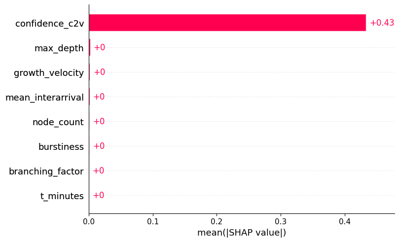
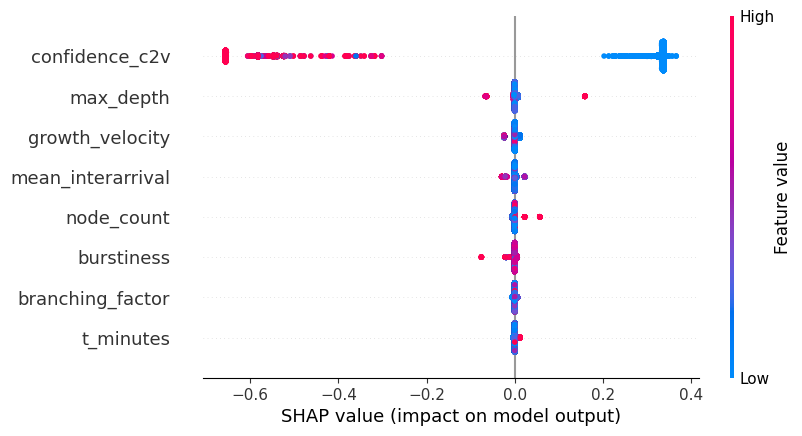
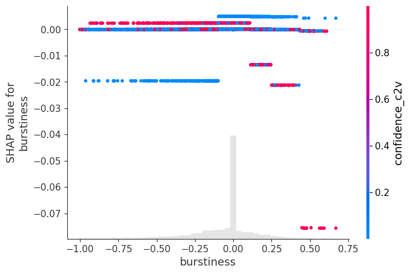
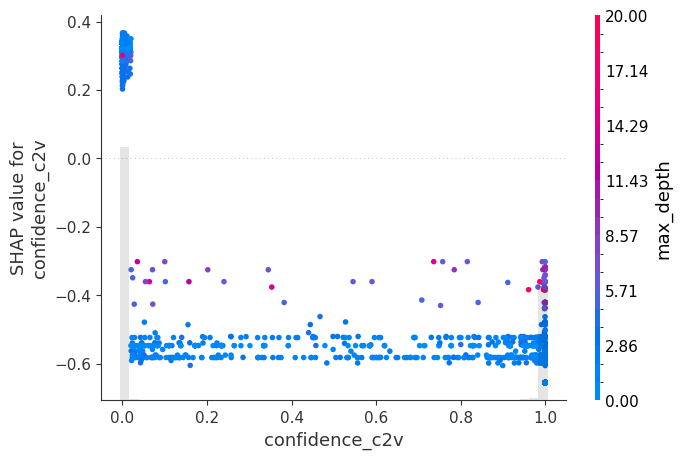

# Phase 15: Explainability (XAI)

## 1. Tabular Explainability (SHAP on Adaptive Threshold)
We computed SHAP values for the XGBoost adaptive threshold model. This shows which structural and temporal features most heavily influence the dynamic stopping threshold.

### Global Feature Importance

### Feature Distribution (Beeswarm)

### Dependence Plots

---

## 2. Graph Explainability (GNNExplainer on CASCADE2VEC)
We applied PyG's `GNNExplainer` to attribute importance to specific edges and nodes within the CASCADE2VEC model's predictions.

> [!WARNING]
> **Limitation: Singletons & Disconnected Cascades**
> GNNExplainer attributes importance over edges. The dataset contains ~358 singleton cascades and ~606 disconnected cascades. These were explicitly excluded from the explanation sample, as the explainer cannot produce meaningful structural attribution without connected edges.

### Sample Explanations
*Review `logs/phase15_xai/plots/` for individual cascade topology plots with edge importance highlighted.*

**Aggregate Statistics:**
The mean edge importance and node importance were computed across the sampled explainable cascades. See `logs/phase15_xai/gnn_explain_stats.csv` for detailed metrics.
